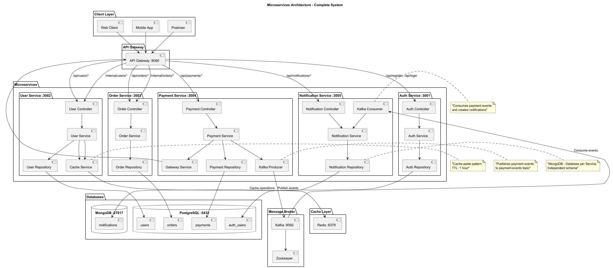

# Microservices Project

Node.js microservices project using Express, PostgreSQL, MongoDB, Kafka, Redis and Docker.

## Architecture

Project consists of 5 microservices with layered architecture:

1. **Auth Service** (port 3001) - user registration and authentication
2. **User Service** (port 3002) - user profile management with Redis caching
3. **Order Service** (port 3003) - order management
4. **Payment Service** (port 3004) - payment processing with Kafka events
5. **Notification Service** (port 3005) - notifications with MongoDB and Kafka consumer
6. **API Gateway** (port 8080) - service integration

## Technologies

- **PostgreSQL** - Shared database for Auth, User, Order, Payment services
- **MongoDB** - Own database for Notification Service (Database per Service pattern)
- **Kafka** - Asynchronous event-driven communication
- **Redis** - In-memory caching for User Service
- **Docker** - Containerization
- **Docker Compose** - Orchestration

### Service structure:
```
service-name/
├── src/
│   ├── controllers/     # HTTP request handlers
│   ├── services/        # Business logic
│   ├── repositories/    # Data access layer
│   ├── models/          # Data models
│   ├── routes/          # API routes
│   ├── middleware/      # Custom middleware
│   ├── config/          # Configuration files
│   ├── app.js           # Express app setup
│   └── server.js        # Server entry point
├── Dockerfile
├── package.json
└── .env
```

## Requirements

- Docker
- Docker Compose

## Installation and Setup

1. Clone the repository:
```bash
git clone <repository-url>
cd microservice-example
```

2. Copy environment configuration:
```bash
cp env.example .env
```

3. Start all services:
```bash
docker-compose up --build
```

All services will be available on the following ports:
- Auth Service: http://localhost:3001
- User Service: http://localhost:3002
- Order Service: http://localhost:3003
- Payment Service: http://localhost:3004
- Notification Service: http://localhost:3005
- API Gateway: http://localhost:8080
- PostgreSQL: localhost:5432
- MongoDB: localhost:27017
- Redis: localhost:6379
- Kafka: localhost:9092

## CI/CD with GitHub Actions

This project includes automated testing workflows that verify all services build and run correctly.

### Available Workflows

1. **Full Service Test** (`.github/workflows/test-services.yml`)
   - Builds all Docker images
   - Starts all services
   - Performs health checks
   - Generates detailed reports
   - Uploads logs as artifacts

2. **Quick Build Check** (`.github/workflows/build-check.yml`)
   - Fast parallel build verification
   - Tests each service individually
   - Provides quick feedback

### Viewing Results

1. Go to **Actions** tab in GitHub
2. Click on a workflow run
3. View logs and download artifacts
4. Check PR comments for automated reports

### Local Testing

Test builds locally using the provided script:

```bash
# Make script executable (Linux/Mac)
chmod +x scripts/test-build.sh

# Run test
./scripts/test-build.sh
```

Or manually:

```bash
# Build and start
docker-compose up --build -d

# Wait for services
sleep 30

# Check health
curl http://localhost:8080/health
curl http://localhost:3001/api/register
curl http://localhost:3002/health
# ... etc
```

For more details, see [.github/workflows/README.md](.github/workflows/README.md)

## Architecture Diagram




## API Endpoints

### Auth Service (http://localhost:3001)

#### POST /api/register
Register new user
```bash
curl -X POST http://localhost:3001/api/register \
  -H "Content-Type: application/json" \
  -d '{"email": "user@example.com", "password": "password123"}'
```

#### POST /api/login
User authentication
```bash
curl -X POST http://localhost:3001/api/login \
  -H "Content-Type: application/json" \
  -d '{"email": "user@example.com", "password": "password123"}'
```

### User Service (http://localhost:3002)

**All requests require JWT token in Authorization header: Bearer <token>**

#### GET /api/users
Get list of users
```bash
curl -X GET http://localhost:3002/api/users \
  -H "Authorization: Bearer <your-jwt-token>"
```

#### GET /api/users/:id
Get user by ID
```bash
curl -X GET http://localhost:3002/api/users/1 \
  -H "Authorization: Bearer <your-jwt-token>"
```

#### POST /api/users
Create user profile
```bash
curl -X POST http://localhost:3002/api/users \
  -H "Authorization: Bearer <your-jwt-token>" \
  -H "Content-Type: application/json" \
  -d '{"name": "John Doe", "email": "john@example.com", "phone": "+1234567890", "address": "123 Main St"}'
```

#### PUT /api/users/:id
Update user profile
```bash
curl -X PUT http://localhost:3002/api/users/1 \
  -H "Authorization: Bearer <your-jwt-token>" \
  -H "Content-Type: application/json" \
  -d '{"name": "John Smith", "email": "johnsmith@example.com", "phone": "+1234567890", "address": "456 Oak Ave"}'
```

#### DELETE /api/users/:id
Delete user profile
```bash
curl -X DELETE http://localhost:3002/api/users/1 \
  -H "Authorization: Bearer <your-jwt-token>"
```

### Order Service (http://localhost:3003)

**All requests require JWT token in Authorization header: Bearer <token>**

#### POST /api/orders
Create order
```bash
curl -X POST http://localhost:3003/api/orders \
  -H "Authorization: Bearer <your-jwt-token>" \
  -H "Content-Type: application/json" \
  -d '{"product_name": "Laptop", "quantity": 1, "price": 999.99}'
```

#### GET /api/orders
Get user orders
```bash
curl -X GET http://localhost:3003/api/orders \
  -H "Authorization: Bearer <your-jwt-token>"
```

#### GET /api/orders/:id
Get order by ID
```bash
curl -X GET http://localhost:3003/api/orders/1 \
  -H "Authorization: Bearer <your-jwt-token>"
```

#### DELETE /api/orders/:id
Delete order
```bash
curl -X DELETE http://localhost:3003/api/orders/1 \
  -H "Authorization: Bearer <your-jwt-token>"
```

### Payment Service (http://localhost:3004)

**All requests require JWT token in Authorization header: Bearer <token>**

#### POST /api/payments
Create payment
```bash
curl -X POST http://localhost:3004/api/payments \
  -H "Authorization: Bearer <your-jwt-token>" \
  -H "Content-Type: application/json" \
  -d '{"userId": 1, "orderId": 1, "amount": 99.99}'
```

#### GET /api/payments/:id
Get payment by ID
```bash
curl -X GET http://localhost:3004/api/payments/1 \
  -H "Authorization: Bearer <your-jwt-token>"
```

#### GET /api/payments/user/:userId
Get payments by user ID
```bash
curl -X GET http://localhost:3004/api/payments/user/1 \
  -H "Authorization: Bearer <your-jwt-token>"
```

#### PUT /api/payments/:id/status
Update payment status
```bash
curl -X PUT http://localhost:3004/api/payments/1/status \
  -H "Authorization: Bearer <your-jwt-token>" \
  -H "Content-Type: application/json" \
  -d '{"status": "success"}'
```

### Notification Service (http://localhost:3005)

#### GET /api/notifications/user/:userId
Get notifications by user ID
```bash
curl -X GET http://localhost:3005/api/notifications/user/1
```

#### GET /api/notifications/:id
Get notification by ID
```bash
curl -X GET http://localhost:3005/api/notifications/1
```

#### PUT /api/notifications/:id/read
Mark notification as read
```bash
curl -X PUT http://localhost:3005/api/notifications/1/read
```

#### PUT /api/notifications/user/:userId/read-all
Mark all notifications as read for user
```bash
curl -X PUT http://localhost:3005/api/notifications/user/1/read-all
```

#### GET /api/notifications/user/:userId/unread-count
Get unread notifications count
```bash
curl -X GET http://localhost:3005/api/notifications/user/1/unread-count
```

#### DELETE /api/notifications/:id
Delete notification
```bash
curl -X DELETE http://localhost:3005/api/notifications/1
```

### API Gateway (http://localhost:8080)

#### GET /users/:id
Get user through gateway (requires JWT token)
```bash
curl -X GET http://localhost:8080/users/1 \
  -H "Authorization: Bearer <your-jwt-token>"
```

#### GET /orders/:id
Get order through gateway (requires JWT token)
```bash
curl -X GET http://localhost:8080/orders/1 \
  -H "Authorization: Bearer <your-jwt-token>"
```

#### GET /internal/users/:id
Internal endpoint for Payment Service (no auth required)
```bash
curl -X GET http://localhost:8080/internal/users/1
```

#### GET /internal/orders/:id
Internal endpoint for Payment Service (no auth required)
```bash
curl -X GET http://localhost:8080/internal/orders/1
```

## Kafka Event-Driven Communication

Payment Service publishes events to Kafka when payments are created or updated:

- **Topic**: `payment-events`
- **Events**:
  - `payment.created` - Published when a payment is created
  - `payment.status.updated` - Published when payment status changes

Notification Service consumes these events and creates notifications automatically.

### Example Kafka Event:
```json
{
  "eventType": "payment.created",
  "timestamp": "2024-01-01T12:00:00.000Z",
  "data": {
    "paymentId": 1,
    "userId": 1,
    "orderId": 1,
    "amount": 99.99,
    "status": "success"
  }
}
```

## Redis Caching

User Service uses Redis for in-memory caching:

- **Cache Strategy**: Cache-aside pattern
- **TTL**: 1 hour (3600 seconds)
- **Cache Keys**: `user:{userId}`
- **Benefits**: 
  - Faster response times for frequently accessed users
  - Reduced database load
  - Automatic cache invalidation on updates/deletes

### Cache Flow:
1. Check Redis cache first
2. If not found, query PostgreSQL database
3. Store result in Redis for future requests
4. Invalidate cache on user updates/deletes

## MongoDB - Database per Service

Notification Service uses MongoDB as its own database:

- **Pattern**: Database per Service
- **Benefits**:
  - Independent schema evolution
  - Technology choice flexibility
  - Service isolation
  - Better scalability

## Complete Workflow Example

1. **User registration:**
```bash
curl -X POST http://localhost:3001/api/register \
  -H "Content-Type: application/json" \
  -d '{"email": "test@example.com", "password": "password123"}'
```

2. **Authentication:**
```bash
curl -X POST http://localhost:3001/api/login \
  -H "Content-Type: application/json" \
  -d '{"email": "test@example.com", "password": "password123"}'
```
Save the received JWT token.

3. **Create user profile:**
```bash
curl -X POST http://localhost:3002/api/users \
  -H "Authorization: Bearer <your-jwt-token>" \
  -H "Content-Type: application/json" \
  -d '{"name": "Test User", "email": "test@example.com", "phone": "+1234567890"}'
```

4. **Create order:**
```bash
curl -X POST http://localhost:3003/api/orders \
  -H "Authorization: Bearer <your-jwt-token>" \
  -H "Content-Type: application/json" \
  -d '{"product_name": "Smartphone", "quantity": 1, "price": 599.99}'
```

5. **Create payment:**
```bash
curl -X POST http://localhost:3004/api/payments \
  -H "Authorization: Bearer <your-jwt-token>" \
  -H "Content-Type: application/json" \
  -d '{"userId": 1, "orderId": 1, "amount": 599.99}'
```

## Database Structure

- **auth_users** - authentication table (Auth Service)
- **users** - user profiles table (User Service)
- **orders** - orders table (Order Service)
- **payments** - payments table (Payment Service)

## Environment Variables

Copy `env.example` to `.env` and configure the following variables:

- `DB_HOST` - database host
- `DB_PORT` - database port
- `DB_NAME` - database name
- `DB_USER` - database user
- `DB_PASSWORD` - database password
- `JWT_SECRET` - JWT secret key
- `JWT_EXPIRES_IN` - JWT token expiration time

## Stopping Services

```bash
docker-compose down
```

For complete cleanup (including data):
```bash
docker-compose down -v
```
