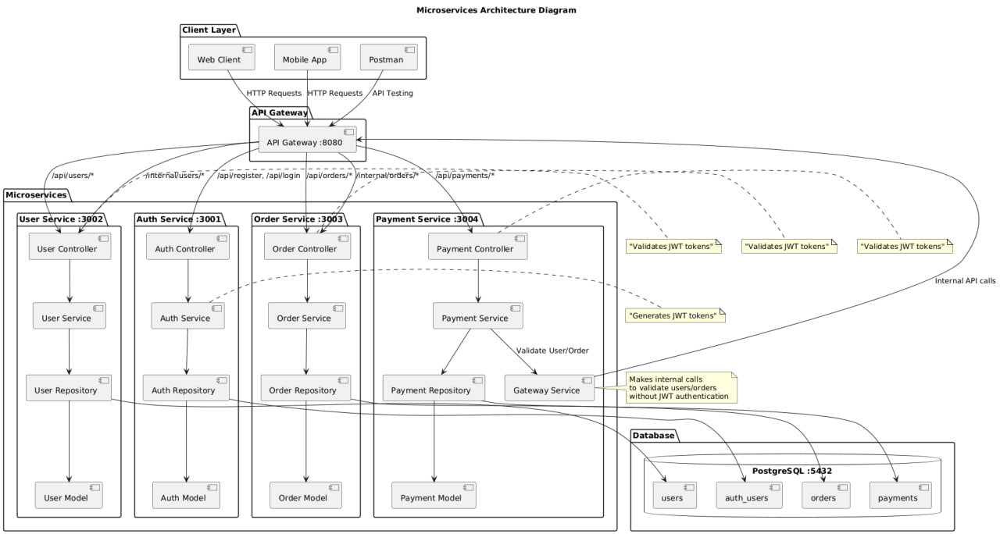

# Microservices Project

Node.js microservices project using Express, PostgreSQL and Docker.

## Architecture

Project consists of 4 microservices with layered architecture:

1. **Auth Service** (port 3001) - user registration and authentication
2. **User Service** (port 3002) - user profile management
3. **Order Service** (port 3003) - order management
4. **Payment Service** (port 3004) - payment processing
5. **API Gateway** (port 8080) - service integration

### Service structure:
```
service-name/
├── src/
│   ├── controllers/     # HTTP request handlers
│   ├── services/        # Business logic
│   ├── repositories/    # Data access layer
│   ├── models/          # Data models
│   ├── routes/          # API routes
│   ├── middleware/      # Custom middleware
│   ├── config/          # Configuration files
│   ├── app.js           # Express app setup
│   └── server.js        # Server entry point
├── Dockerfile
├── package.json
└── .env
```

## Requirements

- Docker
- Docker Compose

## Installation and Setup

1. Clone the repository:
```bash
git clone <repository-url>
cd microservice-example
```

2. Copy environment configuration:
```bash
cp env.example .env
```

3. Start all services:
```bash
docker-compose up --build
```

All services will be available on the following ports:
- Auth Service: http://localhost:3001
- User Service: http://localhost:3002
- Order Service: http://localhost:3003
- Payment Service: http://localhost:3004
- API Gateway: http://localhost:8080
- PostgreSQL: localhost:5432

## Architecture Diagram




## API Endpoints

### Auth Service (http://localhost:3001)

#### POST /api/register
Register new user
```bash
curl -X POST http://localhost:3001/api/register \
  -H "Content-Type: application/json" \
  -d '{"email": "user@example.com", "password": "password123"}'
```

#### POST /api/login
User authentication
```bash
curl -X POST http://localhost:3001/api/login \
  -H "Content-Type: application/json" \
  -d '{"email": "user@example.com", "password": "password123"}'
```

### User Service (http://localhost:3002)

**All requests require JWT token in Authorization header: Bearer <token>**

#### GET /api/users
Get list of users
```bash
curl -X GET http://localhost:3002/api/users \
  -H "Authorization: Bearer <your-jwt-token>"
```

#### GET /api/users/:id
Get user by ID
```bash
curl -X GET http://localhost:3002/api/users/1 \
  -H "Authorization: Bearer <your-jwt-token>"
```

#### POST /api/users
Create user profile
```bash
curl -X POST http://localhost:3002/api/users \
  -H "Authorization: Bearer <your-jwt-token>" \
  -H "Content-Type: application/json" \
  -d '{"name": "John Doe", "email": "john@example.com", "phone": "+1234567890", "address": "123 Main St"}'
```

#### PUT /api/users/:id
Update user profile
```bash
curl -X PUT http://localhost:3002/api/users/1 \
  -H "Authorization: Bearer <your-jwt-token>" \
  -H "Content-Type: application/json" \
  -d '{"name": "John Smith", "email": "johnsmith@example.com", "phone": "+1234567890", "address": "456 Oak Ave"}'
```

#### DELETE /api/users/:id
Delete user profile
```bash
curl -X DELETE http://localhost:3002/api/users/1 \
  -H "Authorization: Bearer <your-jwt-token>"
```

### Order Service (http://localhost:3003)

**All requests require JWT token in Authorization header: Bearer <token>**

#### POST /api/orders
Create order
```bash
curl -X POST http://localhost:3003/api/orders \
  -H "Authorization: Bearer <your-jwt-token>" \
  -H "Content-Type: application/json" \
  -d '{"product_name": "Laptop", "quantity": 1, "price": 999.99}'
```

#### GET /api/orders
Get user orders
```bash
curl -X GET http://localhost:3003/api/orders \
  -H "Authorization: Bearer <your-jwt-token>"
```

#### GET /api/orders/:id
Get order by ID
```bash
curl -X GET http://localhost:3003/api/orders/1 \
  -H "Authorization: Bearer <your-jwt-token>"
```

#### DELETE /api/orders/:id
Delete order
```bash
curl -X DELETE http://localhost:3003/api/orders/1 \
  -H "Authorization: Bearer <your-jwt-token>"
```

### Payment Service (http://localhost:3004)

**All requests require JWT token in Authorization header: Bearer <token>**

#### POST /api/payments
Create payment
```bash
curl -X POST http://localhost:3004/api/payments \
  -H "Authorization: Bearer <your-jwt-token>" \
  -H "Content-Type: application/json" \
  -d '{"userId": 1, "orderId": 1, "amount": 99.99}'
```

#### GET /api/payments/:id
Get payment by ID
```bash
curl -X GET http://localhost:3004/api/payments/1 \
  -H "Authorization: Bearer <your-jwt-token>"
```

#### GET /api/payments/user/:userId
Get payments by user ID
```bash
curl -X GET http://localhost:3004/api/payments/user/1 \
  -H "Authorization: Bearer <your-jwt-token>"
```

#### PUT /api/payments/:id/status
Update payment status
```bash
curl -X PUT http://localhost:3004/api/payments/1/status \
  -H "Authorization: Bearer <your-jwt-token>" \
  -H "Content-Type: application/json" \
  -d '{"status": "success"}'
```

### API Gateway (http://localhost:8080)

#### GET /users/:id
Get user through gateway (requires JWT token)
```bash
curl -X GET http://localhost:8080/users/1 \
  -H "Authorization: Bearer <your-jwt-token>"
```

#### GET /orders/:id
Get order through gateway (requires JWT token)
```bash
curl -X GET http://localhost:8080/orders/1 \
  -H "Authorization: Bearer <your-jwt-token>"
```

#### GET /internal/users/:id
Internal endpoint for Payment Service (no auth required)
```bash
curl -X GET http://localhost:8080/internal/users/1
```

#### GET /internal/orders/:id
Internal endpoint for Payment Service (no auth required)
```bash
curl -X GET http://localhost:8080/internal/orders/1
```

## Complete Workflow Example

1. **User registration:**
```bash
curl -X POST http://localhost:3001/api/register \
  -H "Content-Type: application/json" \
  -d '{"email": "test@example.com", "password": "password123"}'
```

2. **Authentication:**
```bash
curl -X POST http://localhost:3001/api/login \
  -H "Content-Type: application/json" \
  -d '{"email": "test@example.com", "password": "password123"}'
```
Save the received JWT token.

3. **Create user profile:**
```bash
curl -X POST http://localhost:3002/api/users \
  -H "Authorization: Bearer <your-jwt-token>" \
  -H "Content-Type: application/json" \
  -d '{"name": "Test User", "email": "test@example.com", "phone": "+1234567890"}'
```

4. **Create order:**
```bash
curl -X POST http://localhost:3003/api/orders \
  -H "Authorization: Bearer <your-jwt-token>" \
  -H "Content-Type: application/json" \
  -d '{"product_name": "Smartphone", "quantity": 1, "price": 599.99}'
```

5. **Create payment:**
```bash
curl -X POST http://localhost:3004/api/payments \
  -H "Authorization: Bearer <your-jwt-token>" \
  -H "Content-Type: application/json" \
  -d '{"userId": 1, "orderId": 1, "amount": 599.99}'
```

## Database Structure

- **auth_users** - authentication table (Auth Service)
- **users** - user profiles table (User Service)
- **orders** - orders table (Order Service)
- **payments** - payments table (Payment Service)

## Environment Variables

Copy `env.example` to `.env` and configure the following variables:

- `DB_HOST` - database host
- `DB_PORT` - database port
- `DB_NAME` - database name
- `DB_USER` - database user
- `DB_PASSWORD` - database password
- `JWT_SECRET` - JWT secret key
- `JWT_EXPIRES_IN` - JWT token expiration time

## Stopping Services

```bash
docker-compose down
```

For complete cleanup (including data):
```bash
docker-compose down -v
```
